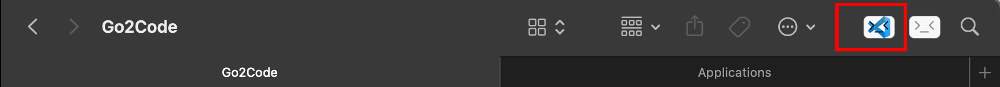

# Go2Code By Model-Map

## Introduction

Go2Code is very simple.
It opens the current folder in Finder in VsCode just by a simple click.

## How to use

- Copy the app to the Application directory。
- Hold down the Command key and drag it to the toolbar.
- Click the icon, Vscode will open with current directory.

## Much Thanks

The main implementation comes from [/Breathleas/Go2Shell/](https://github.com/Breathleas/Go2Shell/), I just changed the icon and added a new window to open Vscode like Go2Shell。
